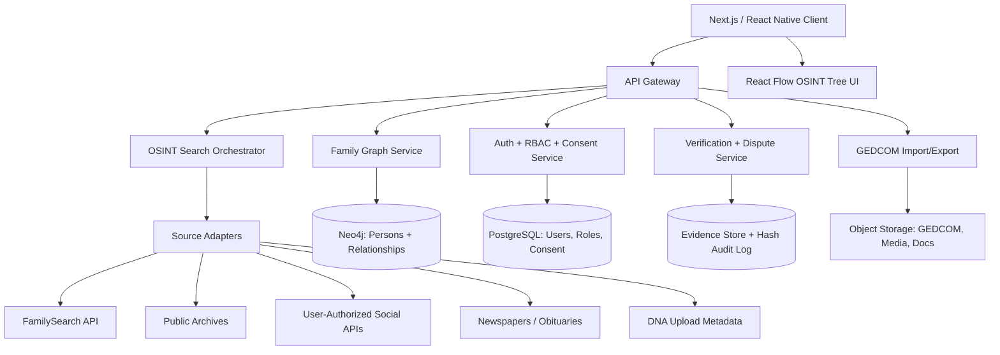
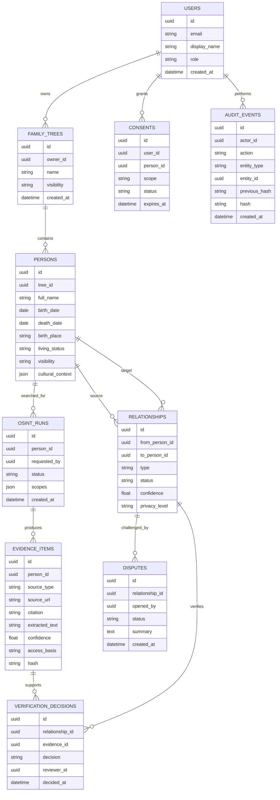
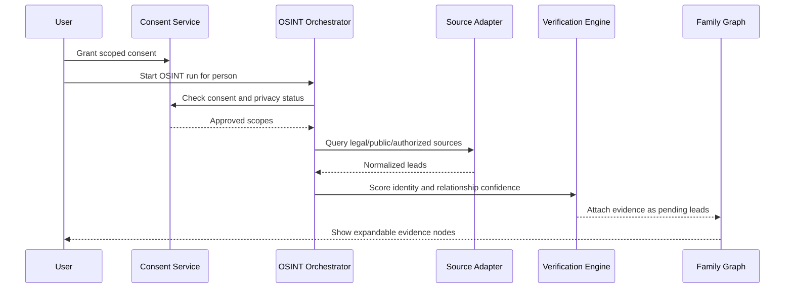

# FamilyTree OSINT Blueprint

This document is a complete product and technical blueprint for **FamilyTree OSINT**, a privacy-focused genealogy application modeled around the OSINT Framework concept: an expandable tree where each person profile doubles as an investigation hub for consent-gated discovery, evidence, and verification.

> Note: the requested "original feature blueprint from 1 Core to 8 Social" was not included in the source prompt. This blueprint follows the provided visible specification and leaves room to merge that missing feature list later.

## Table of Contents

1. [High-Level Architecture](#1-high-level-architecture)
2. [Database Schema](#2-database-schema)
3. [Core UI Wireframes](#3-core-ui-wireframes)
4. [API Endpoints](#4-api-endpoints)
5. [OSINT Module Blueprint](#5-osint-module-blueprint)
6. [AI Prompt Library](#6-ai-prompt-library)
7. [Monetization and Roadmap](#7-monetization-and-roadmap)
8. [Implementation Code Starters](#8-implementation-code-starters)
9. [Testing and Launch Plan](#9-testing-and-launch-plan)
10. [Risks and Mitigations](#10-risks-and-mitigations)
11. [Reference Links](#11-reference-links)

## 1. High-Level Architecture

### System Architecture Diagram



### Core Interaction Model

Every person node is both:

- A genealogy profile.
- An OSINT investigation hub.
- A consent-gated evidence workspace.
- A verification and dispute review surface.

```text
Person Profile
├─ Relationships
│  ├─ Biological
│  ├─ Legal / Adoptive
│  ├─ Marriage / Partner
│  └─ Clan / Lineage / Community
├─ Evidence
│  ├─ Public records
│  ├─ GEDCOM imports
│  ├─ Oral history
│  ├─ DNA metadata
│  └─ Social links
├─ OSINT Pivots
│  ├─ Name variants
│  ├─ DOB / age range
│  ├─ Places
│  ├─ Parents / spouse
│  └─ Community identifiers
└─ Verification
   ├─ Verified
   ├─ Pending
   ├─ Disputed
   └─ Rejected
```

### Recommended Tech Stack

| Component | Recommendation | Rationale |
|---|---|---|
| Frontend | React / Next.js with React Flow or D3.js | Dynamic expandable graph and tree interfaces |
| Mobile | React Native or Flutter | Cross-platform delivery |
| Backend | Node.js / Express or Python / FastAPI | API orchestration and OSINT adapter layer |
| Graph Database | Neo4j | Natural fit for persons, relationships, lineage, clans, and evidence links |
| Relational Database | PostgreSQL | Users, consent, billing, audit metadata, admin workflows |
| Storage | S3-compatible object storage | GEDCOM, uploaded records, media, document images |
| OSINT Integrations | FamilySearch API, GEDCOM, public archives, user-authorized sources | Legal and ethical source access |
| AI/ML | OpenAI/Groq for language tasks, HuggingFace for transcription | Suggestions, duplicate detection, oral history extraction |
| Security | RBAC, field-level privacy, encryption, hash-chained audit logs | Privacy and accountability |
| Hosting | Vercel/AWS/serverless hybrid | Scalable and cost-aware |

## 2. Database Schema

Use Neo4j for the family graph and PostgreSQL for governance, access control, consent, billing, and audit.

### ER Diagram



### Neo4j Relationship Examples

```cypher
(:Person {id: "p1"})-[:PARENT_OF {
  type: "biological",
  confidence: 0.88,
  status: "pending"
}]->(:Person {id: "p2"})

(:Evidence {id: "e1"})-[:SUPPORTS]->(:Relationship {id: "r1"})

(:Person {id: "p1"})-[:BELONGS_TO_CLAN {
  source: "oral_history",
  confidence: 0.64
}]->(:Community {name: "Okonkwo Lineage"})
```

## 3. Core UI Wireframes

### Screen 1: Tree View

```text
┌──────────────── FamilyTree OSINT ────────────────┐
│ Search person...        [Consent: ON] [Export]    │
├───────────────┬───────────────────────────────────┤
│ Filters       │  Root Person                       │
│ □ Verified    │   ├─ Parent                        │
│ □ Pending     │   │   ├─ Evidence: birth record    │
│ □ Disputed    │   │   └─ Pivot: surname variants   │
│ □ Clan links  │   └─ Spouse                        │
│               │       └─ Evidence: marriage cert   │
└───────────────┴───────────────────────────────────┘
```

Primary actions:

- Expand and collapse family branches.
- Toggle OSINT evidence leaves.
- Filter by verification status.
- Open a person node as an investigation hub.
- Export approved data as GEDCOM.

### Screen 2: Person Node

```text
┌─ Person: Amaka Okonkwo ───────────────────────────┐
│ Status: Pending       Visibility: Family-only      │
│ Born: Lagos, Nigeria  DOB: 1974-03-12              │
│ Relationships: 6      Evidence: 14                 │
│ [Run OSINT] [Add Evidence] [Request Consent]       │
└───────────────────────────────────────────────────┘
```

Primary actions:

- View known facts.
- Attach evidence.
- Start a consent-gated OSINT run.
- Request living-person consent.
- Mark claims as verified, pending, disputed, or rejected.

### Screen 3: OSINT Search Pivot

```text
Seed: "Amaka Okonkwo" + Lagos + 1974
├─ Name variants
├─ Civil records
├─ Newspaper / obituary
├─ FamilySearch historical records
├─ Oral history prompt
└─ Suggested match: A. Okonkwo, Lagos, 1974
   Confidence: 72%
   [Attach as lead] [Reject] [Needs review]
```

Primary actions:

- Run source-specific searches.
- Compare suggested leads.
- Attach promising leads as unverified evidence.
- Reject low-quality matches.
- Generate next-step search pivots.

### Screen 4: Timeline

```text
1948 ─ Birth record: parent
1974 ─ Birth: subject
1999 ─ Marriage record
2002 ─ Child record
2024 ─ DNA metadata uploaded
2026 ─ Relationship disputed
```

Primary actions:

- Inspect life events chronologically.
- Detect impossible date conflicts.
- Compare movement and migration.
- Show evidence density over time.

### Screen 5: Admin Dashboard

```text
Privacy Queue | Disputes | Source Health | Audit Logs
-----------------------------------------------------
Consent expiring: 12
Rejected evidence: 4
API rate warnings: 2
GDPR/CCPA deletion requests: 1
```

Primary actions:

- Review consent requests.
- Handle disputes.
- Monitor OSINT source health.
- Process privacy rights requests.
- Export audit logs.

## 4. API Endpoints

```yaml
openapi: 3.1.0
info:
  title: FamilyTree OSINT API
  version: 0.1.0
servers:
  - url: https://api.familytree-osint.example.com
paths:
  /trees:
    post:
      summary: Create a family tree
      security:
        - bearerAuth: []
      requestBody:
        required: true
        content:
          application/json:
            schema:
              type: object
              required:
                - name
              properties:
                name:
                  type: string
                visibility:
                  type: string
                  enum: [private, family, public]
      responses:
        "201":
          description: Created

  /trees/{treeId}/graph:
    get:
      summary: Get renderable person/relationship/evidence graph
      parameters:
        - name: treeId
          in: path
          required: true
          schema:
            type: string
      responses:
        "200":
          description: Graph nodes and edges

  /persons:
    post:
      summary: Create person profile
      security:
        - bearerAuth: []
      requestBody:
        required: true
        content:
          application/json:
            schema:
              $ref: "#/components/schemas/PersonCreate"
      responses:
        "201":
          description: Created

  /relationships:
    post:
      summary: Create relationship with evidence requirements
      security:
        - bearerAuth: []
      responses:
        "201":
          description: Created

  /consents:
    post:
      summary: Grant or revoke consent for OSINT, DNA, social, or visibility scope
      security:
        - bearerAuth: []
      responses:
        "200":
          description: Consent updated

  /osint/search:
    post:
      summary: Start consent-gated OSINT search
      security:
        - bearerAuth: []
      requestBody:
        required: true
        content:
          application/json:
            schema:
              type: object
              required:
                - personId
                - scopes
              properties:
                personId:
                  type: string
                scopes:
                  type: array
                  items:
                    type: string
                    enum:
                      - genealogy
                      - public_records
                      - social_authorized
                      - dna_metadata
                      - newspapers
      responses:
        "202":
          description: OSINT run queued
        "403":
          description: Consent required

  /osint/runs/{runId}:
    get:
      summary: Get OSINT run status and normalized leads
      parameters:
        - name: runId
          in: path
          required: true
          schema:
            type: string
      responses:
        "200":
          description: Run result

  /evidence:
    post:
      summary: Attach evidence to a person or relationship
      security:
        - bearerAuth: []
      responses:
        "201":
          description: Evidence attached

  /verify/link/{relationshipId}:
    post:
      summary: Verify, reject, or mark relationship as disputed
      security:
        - bearerAuth: []
      parameters:
        - name: relationshipId
          in: path
          required: true
          schema:
            type: string
      responses:
        "200":
          description: Verification decision saved

  /gedcom/import:
    post:
      summary: Import GEDCOM file into staged review graph
      security:
        - bearerAuth: []
      responses:
        "202":
          description: Import started

  /gedcom/export/{treeId}:
    get:
      summary: Export approved tree as GEDCOM
      security:
        - bearerAuth: []
      parameters:
        - name: treeId
          in: path
          required: true
          schema:
            type: string
      responses:
        "200":
          description: GEDCOM file

  /audit/events:
    get:
      summary: Immutable audit event feed
      security:
        - bearerAuth: []
      responses:
        "200":
          description: Audit events

components:
  securitySchemes:
    bearerAuth:
      type: http
      scheme: bearer
  schemas:
    PersonCreate:
      type: object
      required:
        - treeId
        - fullName
      properties:
        treeId:
          type: string
        fullName:
          type: string
        birthDate:
          type: string
          format: date
        birthPlace:
          type: string
        livingStatus:
          type: string
          enum: [living, deceased, unknown]
        visibility:
          type: string
          enum: [private, family, public]
```

## 5. OSINT Module Blueprint

### Source Tree

```text
OSINT Sources
├─ Genealogy
│  ├─ FamilySearch API
│  ├─ GEDCOM imports
│  ├─ Public user trees via partnership/import
│  └─ National/regional archives
├─ Civil Records
│  ├─ Birth / marriage / death
│  ├─ Census
│  ├─ Probate / inheritance
│  ├─ Land / address history
│  └─ Immigration / passenger lists
├─ Newspapers
│  ├─ Obituaries
│  ├─ Wedding notices
│  ├─ Community announcements
│  └─ Historical local papers
├─ Community Knowledge
│  ├─ Oral history interviews
│  ├─ Clan / tribe / lineage mapping
│  ├─ Religious/community records
│  └─ Diaspora associations
├─ Social, Consent-Only
│  ├─ User-provided handles
│  ├─ OAuth-authorized profiles
│  └─ Public profile links as citations
└─ DNA, Opt-In Only
   ├─ Uploaded match summaries
   ├─ Shared centimorgan ranges
   ├─ Provider export metadata
   └─ No raw DNA processing in MVP
```

### OSINT Pipeline



### Confidence Scoring

```text
score = source_reliability * identity_match * date_place_match * independence_bonus
penalties = living_person_no_consent + weak_citation + conflicting_evidence
final_score = clamp(score - penalties, 0, 1)
```

### Adapter Policy

Allowed:

- Official APIs.
- Public datasets with clear terms.
- User-authorized OAuth access.
- User-uploaded records and GEDCOM files.
- Manual citations and archive references.

Not allowed:

- Illegal scraping.
- Circumventing paywalls.
- De-anonymizing living people without consent.
- Publishing sensitive claims without review.
- Treating AI output as verified fact.

## 6. AI Prompt Library

1. Extract names, dates, places, and relationships from this record.
2. Identify all spelling variants for this name across Nigerian, English, and diaspora records.
3. Compare these two person profiles and list matching and conflicting fields.
4. Generate a neutral biography using only verified evidence.
5. Explain why this relationship is pending verification.
6. Suggest next public records to check for this person.
7. Detect possible duplicate persons in this tree.
8. Summarize evidence supporting this parent-child relationship.
9. Summarize evidence against this relationship.
10. Draft a respectful consent request to a living relative.
11. Rewrite this family story in culturally sensitive, non-judgmental language.
12. Extract clan, town, migration, and kinship clues from oral history.
13. Flag sensitive data that should not be shown publicly.
14. Generate citation text for this source.
15. Create a dispute summary for neutral reviewer workflow.
16. Identify timeline inconsistencies.
17. Suggest questions for an elder interview.
18. Convert GEDCOM notes into structured evidence.
19. Detect weak OSINT leads likely caused by name collision.
20. Produce a "what we know / what we do not know" summary.
21. Generate privacy-safe sharing copy for a family member.
22. Explain a DNA match in plain language without making medical claims.
23. Identify inherited property or probate research leads.
24. Translate a source summary into plain English for non-technical users.
25. Produce an audit-friendly explanation for why a match was accepted.

## 7. Monetization and Roadmap

### Phased Rollout

| Phase | Time | Scope |
|---|---:|---|
| MVP | 0-3 months | Tree UI, persons, relationships, evidence, consent, GEDCOM import/export, FamilySearch starter adapter, manual source citations |
| V2 | 3-6 months | AI suggestions, duplicate detection, timeline anomalies, richer public archive adapters, dispute workflow |
| V3 | 6-12 months | DNA metadata, inheritance/probate research, clan/community portals, collaboration rooms |
| Scale | 12+ months | Mobile apps, partner APIs, regional archive partnerships, multilingual transcription |

### Ethical Monetization

| Tier | Features |
|---|---|
| Free | Private tree, manual evidence, GEDCOM import/export |
| Premium | Deeper OSINT runs, AI summaries, archive workflows |
| Family/Clan | Shared governance, reviewer roles, oral history vault |
| Professional | Genealogist workspace, audit exports, client consent packs |

### MVP Feasible in Three Months

Month 1:

- Auth, user accounts, tree creation.
- Person and relationship CRUD.
- React Flow tree view.
- Basic evidence attachment.

Month 2:

- Consent service.
- GEDCOM import/export.
- FamilySearch adapter.
- Verification statuses.

Month 3:

- Timeline view.
- Admin dashboard.
- Dispute workflow.
- Beta hardening, security review, and launch prep.

## 8. Implementation Code Starters

### React OSINT Tree Node

```tsx
import { Handle, Position, type NodeProps } from "@xyflow/react";

type Status = "verified" | "pending" | "disputed" | "rejected" | "needs_consent";

type OsintNodeData = {
  label: string;
  kind: "person" | "relationship" | "source" | "evidence";
  status: Status;
  confidence?: number;
  visibility: "private" | "family" | "public";
  onRunSearch?: (nodeId: string) => void;
};

const statusLabel: Record<Status, string> = {
  verified: "Verified",
  pending: "Pending",
  disputed: "Disputed",
  rejected: "Rejected",
  needs_consent: "Consent required",
};

export function OsintTreeNode({ id, data }: NodeProps<OsintNodeData>) {
  const locked = data.status === "needs_consent";

  return (
    <div className={`osint-node osint-node--${data.kind}`}>
      <Handle type="target" position={Position.Left} />

      <div className="osint-node__top">
        <strong>{data.label}</strong>
        <span>{statusLabel[data.status]}</span>
      </div>

      <div className="osint-node__meta">
        {data.kind} · {data.visibility}
        {typeof data.confidence === "number"
          ? ` · ${Math.round(data.confidence * 100)}%`
          : ""}
      </div>

      <button disabled={locked} onClick={() => data.onRunSearch?.(id)}>
        {locked ? "Consent required" : "Run OSINT"}
      </button>

      <Handle type="source" position={Position.Right} />
    </div>
  );
}
```

### Backend FamilySearch Query Endpoint

```ts
import express from "express";

const app = express();

app.get("/api/osint/familysearch/personas", async (req, res) => {
  const token = await getUserProviderToken(req, "familysearch");
  const hasConsent = await requireConsent(req, "genealogy_osint");

  if (!hasConsent) {
    return res.status(403).json({ error: "Consent required" });
  }

  const { givenName, surname, birthLikeDate, birthLikePlace } = req.query;

  if (!surname) {
    return res.status(400).json({ error: "surname is required" });
  }

  const params = new URLSearchParams();

  if (givenName) {
    params.set("q.givenName", String(givenName));
  }

  params.set("q.surname", String(surname));

  if (birthLikeDate) {
    params.set("q.birthLikeDate", String(birthLikeDate));
  }

  if (birthLikePlace) {
    params.set("q.birthLikePlace", String(birthLikePlace));
  }

  params.set("count", "20");

  const response = await fetch(
    `https://api.familysearch.org/platform/records/personas?${params}`,
    {
      headers: {
        Authorization: `Bearer ${token.accessToken}`,
        Accept: "application/x-gedcomx-atom+json",
      },
    }
  );

  if (!response.ok) {
    return res.status(response.status).json({ error: await response.text() });
  }

  const data = await response.json();
  res.json(normalizeFamilySearchResults(data));
});
```

### GEDCOM Parser Starter

```ts
import fs from "node:fs/promises";

type GedLine = {
  level: number;
  pointer?: string;
  tag: string;
  value?: string;
};

function parseLine(line: string): GedLine {
  const parts = line.trim().split(/\s+/);
  const level = Number(parts.shift());
  let pointer: string | undefined;

  if (parts[0]?.startsWith("@")) {
    pointer = parts.shift();
  }

  const tag = parts.shift() ?? "";
  const value = parts.join(" ") || undefined;

  return { level, pointer, tag, value };
}

export async function parseGedcom(path: string) {
  const text = await fs.readFile(path, "utf8");
  const lines = text.split(/\r?\n/).filter(Boolean).map(parseLine);

  const people = new Map<string, any>();
  let current: any = null;

  for (const line of lines) {
    if (line.level === 0 && line.tag === "INDI" && line.pointer) {
      current = { id: line.pointer, names: [], facts: [] };
      people.set(line.pointer, current);
      continue;
    }

    if (!current) {
      continue;
    }

    if (line.level === 1 && line.tag === "NAME") {
      current.names.push(line.value);
    }

    if (line.level === 1 && ["BIRT", "DEAT", "MARR"].includes(line.tag)) {
      current.facts.push({ type: line.tag });
    }

    if (line.level === 2 && ["DATE", "PLAC"].includes(line.tag)) {
      current.facts[current.facts.length - 1][line.tag.toLowerCase()] =
        line.value;
    }
  }

  return [...people.values()];
}
```

### Audit Hash Starter

```ts
import crypto from "node:crypto";

type AuditPayload = {
  actorId: string;
  action: string;
  entityType: string;
  entityId: string;
  previousHash: string;
  createdAt: string;
  metadata?: Record<string, unknown>;
};

export function createAuditHash(payload: AuditPayload) {
  const normalized = JSON.stringify(payload, Object.keys(payload).sort());

  return crypto
    .createHash("sha256")
    .update(normalized)
    .digest("hex");
}
```

### Relationship Confidence Starter

```ts
type EvidenceScoreInput = {
  sourceReliability: number;
  identityMatch: number;
  datePlaceMatch: number;
  independenceBonus: number;
  penalties: number;
};

export function scoreRelationship(input: EvidenceScoreInput) {
  const raw =
    input.sourceReliability *
      input.identityMatch *
      input.datePlaceMatch *
      input.independenceBonus -
    input.penalties;

  return Math.max(0, Math.min(1, raw));
}
```

## 9. Testing and Launch Plan

### Security and Privacy Audit Checklist

| Area | Test |
|---|---|
| Consent | OSINT run is blocked without explicit scope |
| Living persons | Living profiles are private by default |
| Evidence | Accepted relationships require citations or uploaded evidence |
| Audit | Audit hash chain cannot be edited silently |
| Privacy rights | Delete, export, correction, and access requests are supported |
| API safety | Rate limits, retries, and provider terms are respected |
| AI | Human review is required before relationship changes |
| Mobile | Low-bandwidth mode works for diaspora users |
| Access control | Role-based visibility works across family/admin/reviewer roles |
| Data minimization | OSINT results store only necessary fields |

### Beta Launch Cohorts

| Cohort | Goal |
|---|---|
| Genealogy hobbyists | Validate GEDCOM import/export and manual evidence |
| Nigerian/Lagos diaspora families | Validate clan, place, naming, and oral-history flows |
| Professional genealogists | Validate evidence and dispute workflow |
| Privacy reviewers | Validate consent, audit, and data rights design |

### Launch Positioning

Core message:

```text
Build your family tree with sources, consent, and cultural memory intact.
```

Audience segments:

- Diaspora families reconnecting across countries.
- Clan and community historians.
- Genealogy hobbyists who want stronger evidence workflows.
- Professional genealogists who need audit-ready collaboration.
- Families handling inheritance, probate, or oral history preservation.

## 10. Risks and Mitigations

| Risk | Mitigation |
|---|---|
| False family matches | Confidence scores, human review, dispute branches |
| Privacy harm to living relatives | Consent gates, private default, sensitive-field masking |
| Illegal scraping | API/partnership/import-only adapter policy |
| API limits or disappearing sources | Queueing, caching, source health dashboard |
| Cultural flattening | Flexible kinship types, clan/community fields, local language aliases |
| DNA sensitivity | Opt-in only, metadata-first, no medical inference |
| Family conflict | Neutral labels, counter-evidence, reviewer workflow |
| Regulatory exposure | GDPR/CCPA workflows, privacy risk process, data minimization |
| AI hallucination | AI outputs treated as suggestions, not evidence |
| Source bias | Require source quality labels and independent corroboration |

## 11. Reference Links

- [FamilySearch OAuth Documentation](https://developers.familysearch.org/main/docs/authentication)
- [FamilySearch Record Persona Search](https://www.familysearch.org/en/developers/docs/api/records/Record_Persona_Search_resource)
- [FamilySearch GEDCOM Specifications](https://gedcom.io/specs/)
- [React Flow Core Concepts](https://reactflow.dev/docs/overview/core-concepts)
- [Neo4j Graph Database Concepts](https://neo4j.com/docs/getting-started/appendix/graphdb-concepts/)
- [European Commission GDPR Principles](https://commission.europa.eu/law/law-topic/data-protection/rules-business-and-organisations/principles-gdpr_en)
- [California CCPA Rights](https://privacy.ca.gov/california-privacy-rights/rights-under-the-california-consumer-privacy-act/)
- [NIST Privacy Framework](https://www.nist.gov/privacy-framework)
- [Bellingcat Data Collection Principles](https://www.bellingcat.com/about/principles-for-data-collection)
